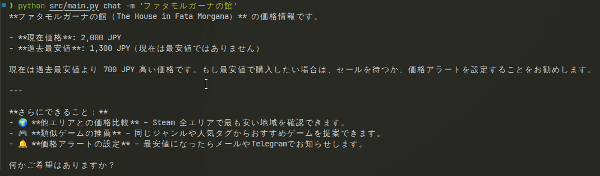
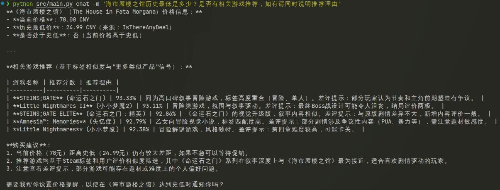
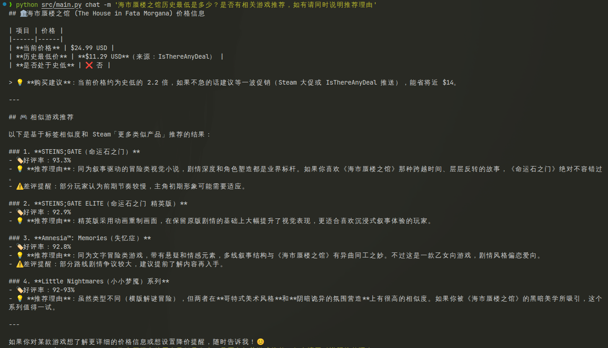
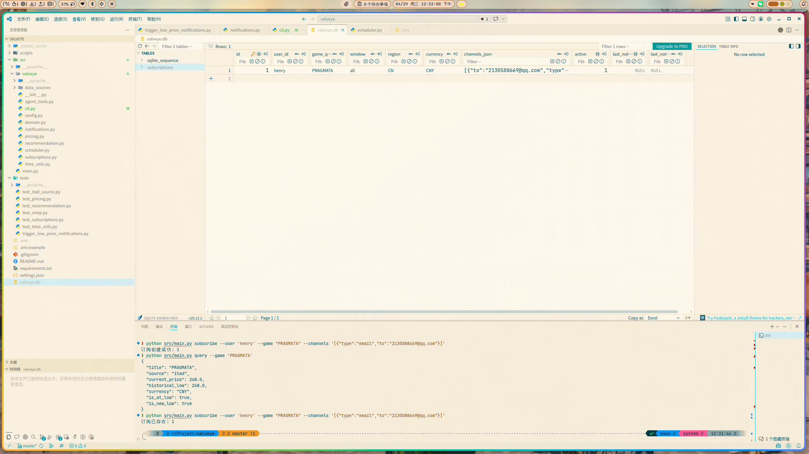
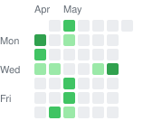

<div align="center">

# 🎮 Valveye

**Steam 游戏价格 Agent** — 查史低、跨区比价、推荐好游、订阅提醒，一句话搞定。

<br/>


<br/>

基于 **LangChain + LangGraph** 构建的智能对话式 Steam 助手，支持多轮对话与流式输出，集成多个价格数据源，覆盖 **23 个 Steam 区域**。

</div>

---

## 📖 功能一览

| 能力 | 说明 |
|:-----|:-----|
| 💬 对话式交互 | 基于 LangChain Agent + LangGraph，支持多轮记忆与流式输出 |
| 📉 史低价格查询 | IsThereAnyDeal / SteamDB / CheapShark 多源自动降级 |
| 🌍 跨区价格对比 | 23 个 Steam 区域并发查询，自动汇率转换，按价格排序 |
| 🗺️ 区域自动检测 | 输入语言 + 系统时区双重推断，无需手动指定区域/货币 |
| 🌐 多语言游戏名 | 中文 / 日文 / 韩文 / 俄文等非英文名自动翻译为 Steam 官方英文名 |
| 🎯 推荐相似游戏 | 基于标签、评测与相似产品智能推荐 |
| 🔔 价格提醒订阅 | 史低 / 新史低触发，支持 7 种通知渠道 |
| ⏰ 定时检测 | 每日自动巡检订阅游戏价格变动 |

### 📬 通知渠道

`Email` · `Telegram` · `企业微信` · `飞书` · `钉钉` · `Discord` · `QQ`

## 🚀 快速开始

```bash
# 克隆项目
git clone https://github.com/LahenVieLesry/valveye.git
cd valveye

# 安装依赖
pip install -r requirements.txt

# 配置环境变量
cp .env.example .env
# 编辑 .env 填入 OpenAI API Key 等配置
```

### 💬 对话模式

```bash
# 交互式对话
python src/main.py chat

# 单次查询
python src/main.py chat -m "艾尔登法环多少钱"

# 跨区比价
python src/main.py chat -m "Persona 5 哪个区最便宜"

# 日文输入，自动识别日区
python src/main.py chat -m "ファタモルガーナの館の価格は？"
```

## 🛠️ 工具列表

| 工具 | 功能 | 示例触发 |
|:-----|:-----|:---------|
| `query_low_price` | 查询当前价与史低 | "赛博朋克 2077 多少钱" |
| `compare_prices` | 全区域跨区比价 | "艾尔登法环哪个区最便宜" |
| `recommend_similar_games` | 推荐同类游戏 | "推荐几个像空洞骑士的游戏" |
| `subscribe_game` | 订阅价格提醒 | "Persona 5 史低时通知我" |
| `list_subscriptions` | 查看有效订阅 | "我有哪些订阅" |

## 🌍 区域支持

自动检测覆盖 23 个 Steam 区域：

| 区域 | 货币 | 区域 | 货币 | 区域 | 货币 |
|:-----|:-----|:-----|:-----|:-----|:-----|
| 美区 | USD | 英区 | GBP | 欧区 | EUR |
| 国区 | CNY | 日区 | JPY | 韩区 | KRW |
| 台区 | TWD | 港区 | HKD | 新加坡区 | SGD |
| 澳区 | AUD | 加区 | CAD | 墨区 | MXN |
| 巴区 | BRL | 阿区 | ARS | 智利区 | CLP |
| 哥伦比亚区 | COP | 印区 | INR | 俄区 | RUB |
| 土区 | TRY | 乌区 | UAH | 哈区 | KZT |
| 南非区 | ZAR | 阿联酋区 | AED | | |

> **检测优先级**：非拉丁文字直接匹配 → 系统语言 / 时区推断 → 美区兜底

## 📸 效果展示

<details>
<summary>点击展开截图</summary>

<br/>

**跨区比价与区域自动检测**



**游戏推荐**




**价格提醒邮件通知**



</details>

## 📁 项目结构

```
src/valveye/
├── agent.py           # LangChain Agent 构建与对话入口
├── agent_tools.py     # Agent 工具定义
├── cli.py             # CLI 入口（chat / subscribe / check）
├── config.py          # 配置管理
├── domain.py          # 领域模型
├── notifications.py   # 多渠道通知（7 种渠道）
├── pricing.py         # 价格查询、区域检测、汇率转换
├── recommendation.py  # 游戏推荐引擎
├── scheduler.py       # APScheduler 定时任务
├── subscriptions.py   # SQLite 订阅存储
├── time_utils.py      # 时区工具
└── data_sources/
    ├── base.py        # 价格源抽象基类
    ├── itad.py        # IsThereAnyDeal（支持区域定价）
    ├── steamdb.py     # SteamDB
    └── cheapshark.py  # CheapShark
```

## 📋 TODO

- [ ] 补充测试用例
- [ ] 通知去重 + 重试退避 + 失败落盘
- [ ] Web UI

---

<div align="center">

### 📊 项目面板


<br/>

**📅 更新日历**



</div>

## 🙏 致谢

<details>
<summary>点击展开</summary>

本项目的成长离不开两段"算力接力"。

首先要感谢 **GitHub Copilot 学生计划**——它陪伴本项目度过了最艰难的"嗷嗷待哺"时期，用免费额度一把屎一把尿地把代码拉扯大。好景不长，额度说没就没，项目一度陷入"断奶危机"。

就在这个风雨飘摇的时刻，[小米 MiMo Orbit 百万亿 Token 创造者激励计划](https://100t.xiaomimimo.com/)——向本项目伸出了援手。

起初，它羞涩地递来 **¥5 赠金**。

说实话，看到这个数字的时候，我的内心毫无波澜，甚至想给它回一句"谢谢，够我跑两轮就不错了"。

然后它又掏出了一个 **价值 ¥659 的 Max 月度套餐**。

……好的，你赢了。

从此，本项目告别了"一个请求掰两半用"的苦日子，终于可以放心大胆地让 Agent 反复燃烧 token 了。

感谢小米，感谢 MiMo，感谢这个让穷学生也能玩得起大模型的时代。

</details>
