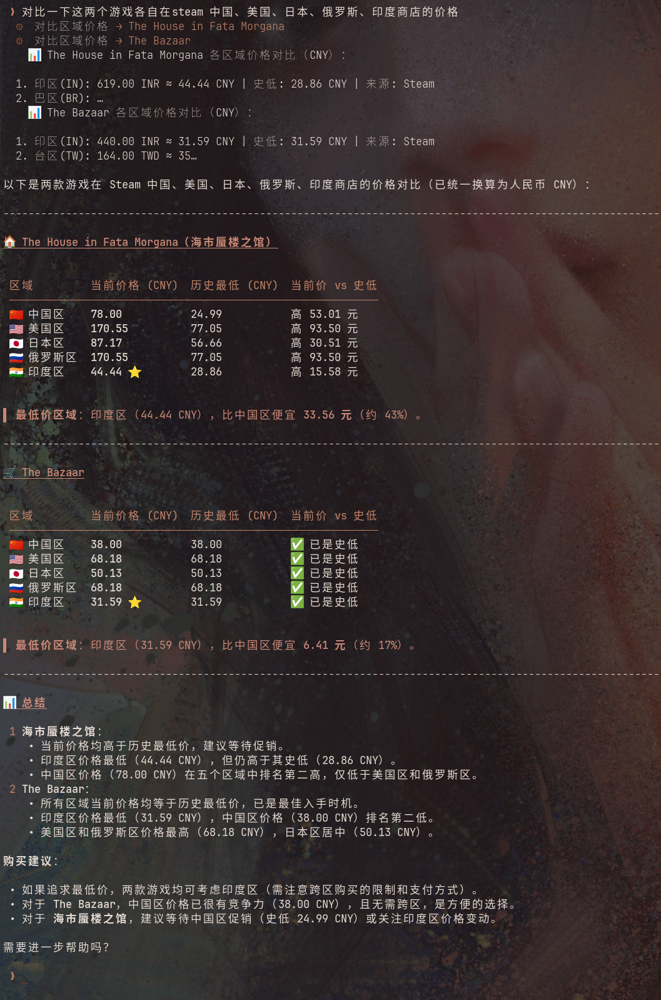
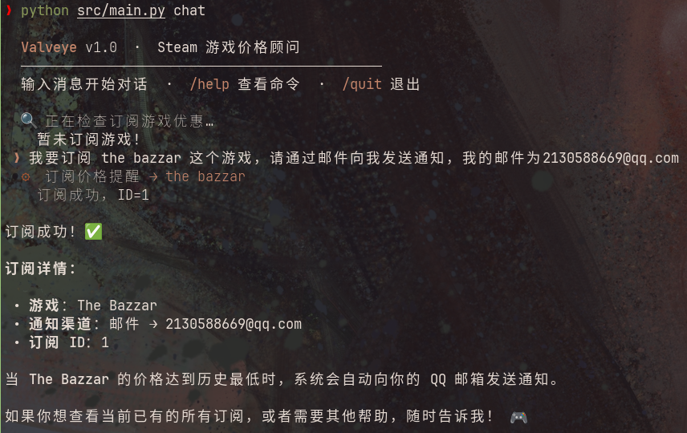
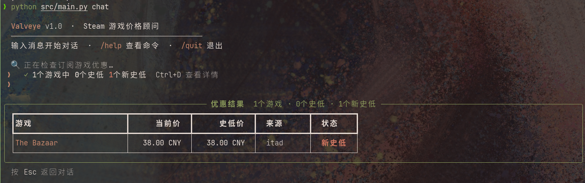
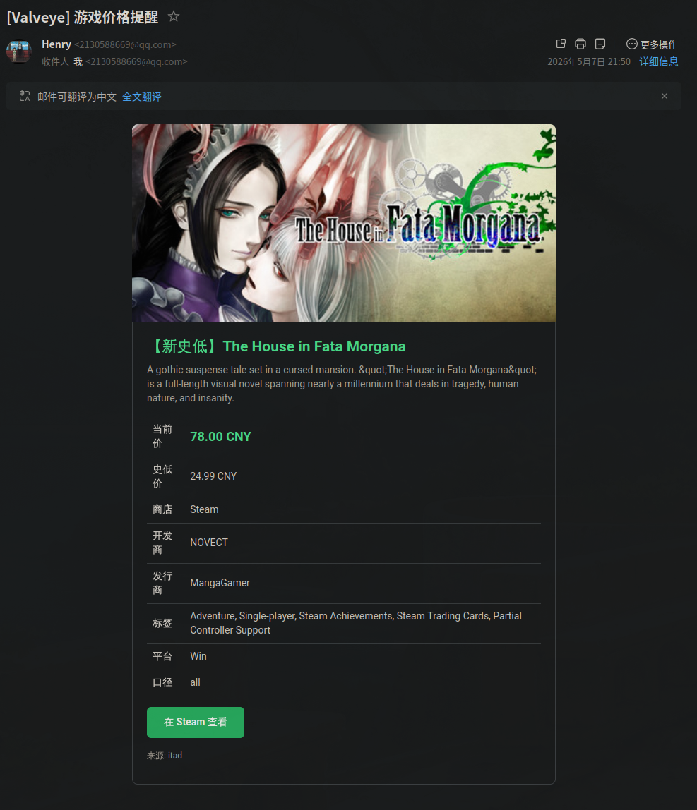
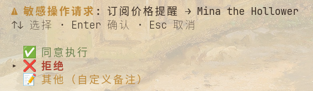

<div align="center">

# 🎮 Valveye

**Steam 游戏价格 Agent** — 查史低、跨区比价、推荐好游、订阅提醒，一句话搞定。

<br/>


<br/>

基于 **LangChain + LangGraph** 构建的智能对话式 Steam 助手，支持多轮对话与流式输出，集成多个价格数据源，覆盖 **23 个 Steam 区域**。

核心 I/O 层采用异步架构（aiohttp / aiosqlite / AsyncIOScheduler），HTTP 请求与 Agent 状态持久化均不阻塞事件循环。

</div>

---

## 📖 功能一览

| 能力 | 说明 |
|:-----|:-----|
| 💬 对话式交互 | 基于 LangChain + LangGraph 的 **Supervisor + 4 Specialist 多 Agent 架构**，支持多轮记忆与流式输出，现代 CLI 界面，对话状态异步持久化到 SQLite（aiosqlite + AsyncSqliteSaver） |
| ⚡ 并行任务执行 | Supervisor 自动分析任务依赖关系，无依赖的多意图任务（如"查价格+求推荐"）**并行执行**；支持同一 Specialist Agent 处理多个独立子任务（如同时查两款游戏的价格），结果分组聚合不覆盖 |
| 📉 史低价格查询 | IsThereAnyDeal / SteamDB / CheapShark 多源自动降级 |
| 🌍 跨区价格对比 | 23 个 Steam 区域并发查询，自动汇率转换，按价格排序 |
| 🗺️ 区域自动检测 | 输入语言 + 系统时区双重推断，无需手动指定区域/货币 |
| 🌐 多语言游戏名 | 中文 / 日文 / 韩文 / 俄文等非英文名自动翻译为 Steam 官方英文名 |
| 🎮 Steam 游戏库 | 查询玩家已拥有的 Steam 游戏列表、游戏数量和游玩时长 |
| 🔥 热门游戏查询 | Steam 热销榜 / 新品榜 / 特惠榜 / 即将推出 |
| 🎯 推荐相似游戏 | 基于 BM25 标签权重 + Steam "More Like This" + 工作室亲和度 + 评测质量邻近度多信号融合推荐 |
| 🔍 语义搜索 | 通过自然语言描述（如"开放世界生存建造"）搜索相似游戏，无需知道具体游戏名 |
| 🌐 联网搜索 | DuckDuckGo 网络搜索 + 可信域名网页抓取，获取游戏新闻、评测、攻略 |
| 🔔 价格提醒订阅 | 史低 / 新史低触发，支持 7 种通知渠道，富文本通知（邮件 HTML、Telegram MarkdownV2、Discord Embed、企业微信/飞书/钉钉 Markdown） |
| ⏰ 定时检测 | 每日自动巡检订阅游戏价格变动 |
| 🚀 启动优惠检查 | 进入对话时自动检查所有订阅游戏的优惠状态，工具栏实时展示，Ctrl+D 查看详情 |
| 🛡️ 响应校验 | Guardrails 自动校验 LLM 回复中的价格等信息与工具返回数据的一致性，防止幻觉 |
| 🔒 权限确认 | 订阅等敏感操作需用户实时确认，支持并发任务隔离 + 顺序队列 |
| 📝 操作审计 | 完整的工具调用链路追踪与审计日志，支持 `/audit` 命令查看 |
| 👤 用户画像 | 基于用户对推荐结果的反馈（喜欢/不喜欢/忽略），自动调整标签权重，实现个性化推荐 |
| 🧠 长期记忆 | 基于 OpenViking 的 L0/L1/L2 三层渐进式记忆架构，自动召回相关上下文、自动提取长期记忆，跨会话个性化响应 |
| 🔌 MCP 服务器 | 通过 MCP 协议对外暴露游戏查询工具，可被 Claude Desktop、Cursor 等客户端直接调用 |

### 📬 通知渠道

`Email` · `Telegram` · `企业微信` · `飞书` · `钉钉` · `Discord` · `QQ`

## 🚀 快速开始

```bash
# 克隆项目
git clone https://github.com/LahenVieLesry/valveye.git
cd valveye

# 方式一：pip 安装依赖
pip install -r requirements.txt

# 方式二：通过 pyproject.toml 安装（推荐，含开发依赖）
pip install -e ".[dev]"

# 配置环境变量
cp .env.example .env
# 编辑 .env 填入 OpenAI API Key 等配置
```

### 💬 对话模式

```bash
# 交互式对话（带斜杠命令补全、思考过程折叠、Markdown 渲染）
python src/main.py chat
# 或安装后直接使用
valveye chat

# 单次查询
python src/main.py chat -m "艾尔登法环多少钱"

# 跨区比价
python src/main.py chat -m "Persona 5 哪个区最便宜"

# 日文输入，自动识别日区
python src/main.py chat -m "ファタモルガーナの館の価格は？"

# 查询 Steam 游戏库
python src/main.py chat -m "我有哪些游戏"

# 查看热门游戏
python src/main.py chat -m "最近有什么热销游戏"
```

### 🔌 MCP 服务器

```bash
# 启动 MCP 服务器（stdio 模式，供 Claude Desktop / Cursor 等调用）
valveye-mcp

# 或在 mcp_config.json 中配置
{
  "mcpServers": {
    "valveye": {
      "command": "python",
      "args": ["-m", "valveye.mcp_server"],
      "env": { "OPENAI_API_KEY": "your-key", "ITAD_API_KEY": "your-key" }
    }
  }
}
```

**交互式 CLI 功能：**

| 功能 | 说明 |
|:-----|:-----|
| `/` 斜杠命令 | 输入 `/` 自动补全，快速执行常用操作 |
| 💭 思考折叠 | Agent 推理过程实时流式显示，完成后可折叠/展开（按 `T` 切换） |
| Markdown 渲染 | AI 回复支持粗体、列表、代码块等富文本格式 |
| 命令历史 | 上下箭头浏览历史输入，支持多行编辑 |
| 对话管理 | 双击 `Esc` 切换对话，`/resume` 恢复历史，`/new` 新建 |
| 启动优惠检查 | 进入对话自动检查订阅游戏优惠，工具栏显示结果摘要 |
| Ctrl+D 优惠详情 | 启动检查发现优惠后，Ctrl+D 弹出详情表格 |
| 🔒 权限确认 | 敏感操作（订阅）弹出确认菜单，防止误操作 |
| 对话导出 | `/export` 导出为 Markdown / JSON / HTML，Copilot 风格折叠格式 |
| 审计日志 | `/audit [tool_name]` 查看工具调用审计记录 |

**可用斜杠命令：**

| 命令 | 说明 |
|:-----|:-----|
| `/query <游戏名>` | 快速查询游戏价格 |
| `/recommend <游戏名>` | 推荐相似游戏 |
| `/subscribe <游戏名>` | 订阅价格提醒 |
| `/list` | 查看当前订阅列表 |
| `/export [md\|json\|html]` | 导出当前对话（Copilot 风格折叠格式） |
| `/resume` | 恢复历史对话 |
| `/new` | 开始新对话 |
| `/audit [tool_name]` | 查看操作审计日志 |
| `/help` | 显示帮助信息 |
| `/model` | 显示当前模型信息 |
| `/clear` | 清屏 |
| `/quit` | 退出对话 |

> **对话切换**：连按两次 `Esc` 打开对话切换菜单，支持方向键和数字快捷选择。

## 🛠️ 工具列表

| 工具 | 功能 | 示例触发 |
|:-----|:-----|:---------|
| `query_low_price` | 查询当前价与史低 | "赛博朋克 2077 多少钱" |
| `compare_prices` | 全区域跨区比价 | "艾尔登法环哪个区最便宜" |
| `recommend_similar_games` | 推荐同类游戏 | "推荐几个像空洞骑士的游戏" |
| `subscribe_game` | 订阅价格提醒 | "Persona 5 史低时通知我" |
| `list_subscriptions` | 查看有效订阅 | "我有哪些订阅" |
| `request_game_details` | Agent 间 Handoff：请求游戏详情 | 推荐流程中自动触发 |
| `get_player_library` | 查询 Steam 游戏库 | "我有哪些游戏" |
| `get_trending_games` | 查询 Steam 热门游戏 | "最近有什么热销游戏" |
| `search_by_description` | 按描述语义搜索游戏 | "推荐开放世界生存建造游戏" |
| `web_search` | 联网搜索游戏资讯 | "黑神话悟空的媒体评测怎么样" |
| `web_fetch` | 抓取指定网页内容 | 深度阅读某篇评测文章 |

## 🌍 区域支持

自动检测覆盖 23 个 Steam 区域：

| 区域 | 货币 | 区域 | 货币 | 区域 | 货币 |
|:-----|:-----|:-----|:-----|:-----|:-----|
| 美区 | USD | 英区 | GBP | 欧区 | EUR |
| 国区 | CNY | 日区 | JPY | 韩区 | KRW |
| 台区 | TWD | 港区 | HKD | 新加坡区 | SGD |
| 澳区 | AUD | 加区 | CAD | 墨区 | MXN |
| 巴区 | BRL | 阿区 | ARS | 智利区 | CLP |
| 哥伦比亚区 | COP | 印区 | INR | 俄区 | RUB |
| 土区 | TRY | 乌区 | UAH | 哈区 | KZT |
| 南非区 | ZAR | 阿联酋区 | AED | | |

> **检测优先级**：非拉丁文字直接匹配 → 系统语言 / 时区推断 → 美区兜底

## 🧠 记忆架构

集成 [OpenViking](https://github.com/volcengine/OpenViking)（火山引擎开源，23k+ stars）作为长期记忆层，采用 **L0 / L1 / L2 三层渐进式加载**，按需注入上下文而非全量加载，token 利用率提升 90%+。

```
用户消息 → Auto-Recall (语义检索相关记忆) → 注入上下文 → Agent 处理 → Auto-Capture (提取记忆)
                                      ↕
                           OpenViking Server (port 1933)
                           viking://user/memories/  (用户偏好、实体记忆)
                           viking://sessions/       (会话摘要)
```

| 层级 | Token | 用途 |
|:-----|:------|:-----|
| L0 `.abstract.md` | ~100 | 一句话摘要，用于快速索引和相关性判断 |
| L1 `.overview.md` | ~500 | 核心信息与关键决策，注入上下文提供决策依据 |
| L2 完整内容 | 按需 | 原始对话记录，仅在需要深入分析时加载 |

**快速启用：**

```bash
# 安装并启动 OpenViking
pip install openviking
openviking-server init   # 交互式配置
openviking-server        # 启动服务

# 在 .env 中启用
OPENVIKING_ENABLED=1

# 可选：迁移历史对话数据
python scripts/migrate_to_viking.py
```

## 🤖 多 Agent 架构

采用 **Supervisor + 4 Specialist** 的 LangGraph StateGraph 架构，每个 Specialist 拥有独立的工具集与系统提示词：

```text
用户消息 → Supervisor（意图分解 → 有序任务队列）
                ↓
        ┌───────┼───────┬───────┐
        ▼       ▼       ▼       ▼
    Price    Info   Recommend  Subs
    Agent    Agent    Agent    Agent
        └───────┼───────┴───────┘
                ↓
           Post-Process（任务推进 / Handoff / 结束）
```

| Agent | 职责 | 工具 |
|:------|:-----|:-----|
| Price | 价格查询、跨区比价 | `query_low_price`, `compare_prices` |
| Info | 游戏介绍、玩家评价、游戏库、热门游戏 | `get_game_details`, `get_game_reviews`, `get_player_library`, `get_trending_games` |
| Recommend | 相似游戏推荐（含 Handoff 获取详情）、语义搜索 | `search_similar_candidates`, `recommend_similar_games`, `request_game_details`, `search_by_description` |
| Subs | 价格提醒订阅管理 | `subscribe_game`, `list_subscriptions` |

**并行执行**：当用户消息包含多个独立意图（如"查艾尔登法环价格，再推荐几个类似游戏"），Supervisor 自动识别任务间无依赖关系，触发并行执行，各 Specialist 同时运行，最后聚合结果。同一 Agent 的多个子任务（如同时查询两款游戏的价格）也会并行调度，聚合时按 `task_id` 排序分组展示，避免结果互相覆盖。

**Handoff 机制**：Recommend Agent 在深度调查阶段通过 `request_game_details` 触发 Handoff，系统自动调用 Info Agent 的 `get_game_details` 获取游戏详情并注入上下文，无需用户干预。

## 📸 效果展示

<details>
<summary>点击展开截图</summary>

<br/>

**多轮对话与游戏搜索**


**跨区价格对比与区域自动检测**




**游戏推荐**


**游戏订阅与新会话自动检测**




**邮件通知**



**敏感操作权限确认**



</details>

## 📁 项目结构

```
src/valveye/
├── agent.py              # 多 Agent 图构建（Supervisor + Specialist）与对话入口
├── agent_tools.py        # Agent 工具定义与分组
├── chat_store.py         # 对话记录导出（md/json/html）
├── cli.py                # CLI 入口（chat / subscribe / check）
├── config.py             # 配置管理
├── domain.py             # 领域模型
├── embeddings.py         # 语义嵌入（游戏描述向量检索）
├── formatter.py          # 通知消息格式化（邮件 HTML / Telegram / Discord / Markdown）
├── game_data.py          # Steam 游戏数据服务（详情、评测、搜索）
├── guardrails.py         # 响应校验（价格一致性检查，防止 LLM 幻觉）
├── memory.py             # OpenViking 长期记忆层（auto-recall / auto-capture）
├── metrics.py            # 指标采集与监控
├── mcp_server.py         # MCP 服务器（对外暴露工具给外部客户端）
├── notifications.py      # 多渠道通知（7 种渠道）
├── pricing.py            # 价格查询、区域检测、汇率转换
├── prompt_manager.py     # YAML 提示词加载与管理
├── prompts.py            # 提示词常量与模板渲染
├── rate_limiter.py       # 异步速率限制器
├── recommendation.py     # 游戏推荐引擎
├── retry.py              # 异步重试装饰器（指数退避）
├── scheduler.py          # APScheduler 定时任务
├── schemas.py            # Pydantic 结构化模型（路由、错误码）
├── steam_library.py      # Steam 游戏库服务（已拥有游戏查询）
├── subscriptions.py      # SQLite 订阅存储
├── time_utils.py         # 时区工具
├── tracing.py            # 链路追踪与审计日志
├── user_profile.py       # 用户画像与个性化推荐权重
├── web_tools.py          # 联网搜索与网页抓取
└── data_sources/
    ├── base.py           # 价格源抽象基类
    ├── itad.py           # IsThereAnyDeal（支持区域定价）
    ├── steamdb.py        # SteamDB
    └── cheapshark.py     # CheapShark

prompts/
├── info_agent.yaml       # Info Agent 系统提示词
├── price_agent.yaml      # Price Agent 系统提示词
├── recommend_agent.yaml  # Recommend Agent 系统提示词
├── subs_agent.yaml       # Subs Agent 系统提示词
└── supervisor.yaml       # Supervisor 路由提示词

tests/
├── eval/
│   ├── benchmark.json    # 评估基准数据集（32 条用例）
│   ├── conftest.py       # pytest 配置与 fixture
│   └── test_eval.py      # 意图路由准确率 + 响应质量评估
```

## 🧪 评估测试

项目包含基于真实 LLM 调用的自动化评估套件，覆盖意图路由准确率、响应质量等维度：

```bash
# 运行集成评估测试（需要真实 LLM 调用和网络访问）
RUN_INTEGRATION_TESTS=1 pytest tests/eval/ -v

# 运行单元测试
pytest tests/ -m "not integration" --cov=valveye
```

评估基准包含 32 条用例，覆盖价格查询、跨区比价、信息查询、推荐、订阅、多意图、边界 case 等 7 个类别。

## 📋 TODO

- [x] OpenViking 长期记忆层集成（L0/L1/L2 三层渐进式加载）
- [x] 多 Agent 协作架构（Supervisor + 4 Specialist）
- [x] 并行任务执行（依赖分析 + Send API 并行调度）
- [x] Steam 游戏库查询
- [x] Steam 热门游戏查询
- [x] 语义搜索（描述 → 游戏匹配）
- [x] 联网搜索与网页抓取
- [x] Guardrails 响应校验
- [x] 敏感操作权限确认
- [x] 操作审计日志
- [x] 用户画像与个性化推荐
- [x] MCP 服务器
- [x] 评估测试框架（32 条基准用例）
- [x] CI / Lint / Type Check（GitHub Actions + ruff + mypy）
- [ ] 通知去重 + 重试退避 + 失败落盘
- [ ] Web UI

---

<div align="center">

### 📊 项目面板


<br/>

**📅 更新日历**


</div>

## 🙏 致谢

<details>
<summary>点击展开</summary>

本项目的成长离不开两段"算力接力"。

首先要感谢 **GitHub Copilot 学生计划**——它陪伴本项目度过了最艰难的"嗷嗷待哺"时期，用免费额度一把屎一把尿地把代码拉扯大。好景不长，额度说没就没，项目一度陷入"断奶危机"。

就在这个风雨飘摇的时刻，[小米 MiMo Orbit 百万亿 Token 创造者激励计划](https://100t.xiaomimimo.com/)——向本项目伸出了援手。

起初，它羞涩地递来 **¥5 赠金**。

说实话，看到这个数字的时候，我的内心毫无波澜，甚至想给它回一句"谢谢，够我跑两轮就不错了"。

然后它又掏出了一个 **价值 ¥659 的 Max 月度套餐**。

……好的，你赢了。

从此，本项目告别了"一个请求掰两半用"的苦日子，终于可以放心大胆地让 Agent 反复燃烧 token 了。

感谢小米，感谢 MiMo，感谢这个让穷学生也能玩得起大模型的时代。

</details>
